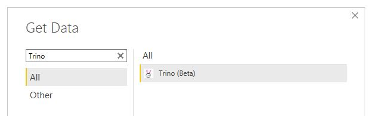
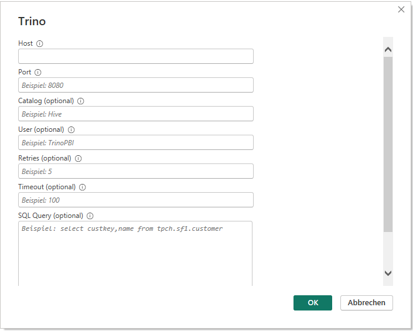
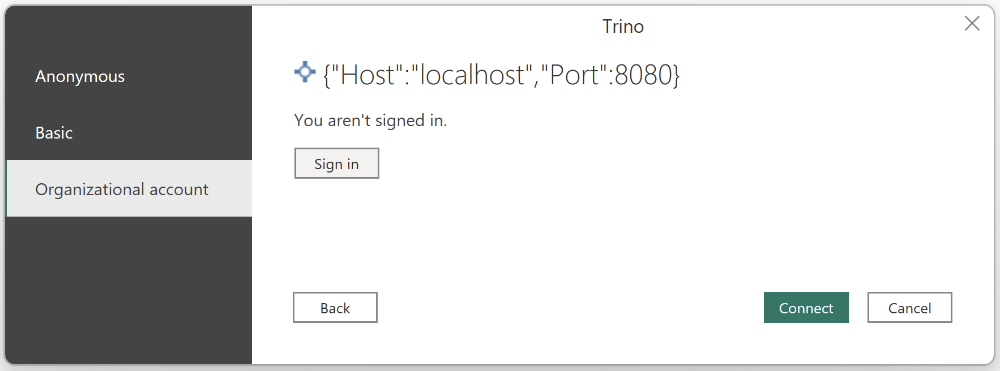
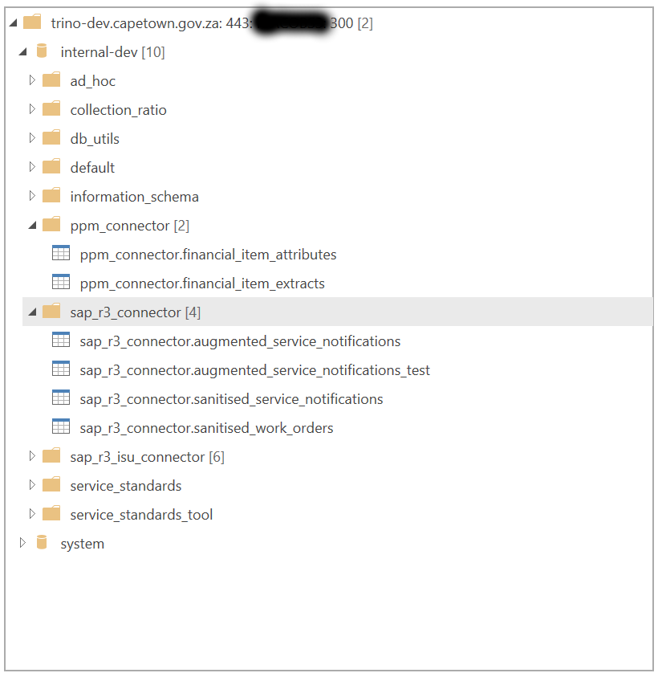

# OPM Data Science Trino Connector Use Notes

## How to Connect to OPM Data Science's Trino
### Requirements
* You must have PowerBI Desktop installed on your laptop.
* You must be connected to the City network (i.e. can you access [CityWeb](https://cityweb.capetown.gov.za)?)

### 1. Download and Install our Custom Connector
1. Download the custom connector configuration from [here](https://lake.capetown.gov.za/power-bi-custom-connector/Trino.pq).
2. Copy the file to the folder `Documents\Power BI Desktop\Custom Connectors`

### 2. Setup and configure the connector
1. Restart PowerBI after completing step (1) above
2. Open the "Get Data Window" and search for the Trino connector
  
3. Complete the required fields to communicate with Trino:
  
  **NB** The only value that should be unique should be the `User` field - this should be your City username, e.g. `ginggs`
4. Use the organizational account option to sign in to your City account:
  
  **NB** This will open up a separate window that loads the OPM GitLab's sign in page. As per the instructions, Sign in using your normal City credentials.
5. You should be able to browse the City's catalogue, as per
  

### 3. Away you go!
Select the desired objects at the end of step (2) and start to transform data. 

You should be able to transform the data before using it, if you wish to avoid loading all the data.

## Frequently Asked Questions
### I can't see the Trino connector in step 2.2
Check that you've put the custom connector configuration in the right folder. If you have, try restarting PowerBI.

### I get an error when I try load data as per 2.5
You probably don't have permission to access that particular dataset. Contact the Data Science team asking for permissions to be granted to your account. They will likely ask you to prove tha the data steward of that dataset approves your access.

### The data I need isn't in the list
Contact the Data Science team to discuss this further. Either the dataset hasn't been exposed to Trino (short term fix), or the Data Science team doesn't have the data you're thinking about. If the latter is the case, you might have to initiate a project with them to extract the data.

## I still have questions!
Contact [the data science team](mailto:gordon.inggs@capetown.gov.za)